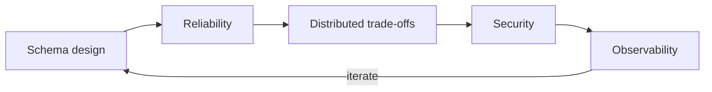

### 👋🏻 Hi, I'm Amir

Software Engineer based in Yerevan, Armenia, with 8 years of experience building reliable systems in **Python** and **Go**.

[LinkedIn](https://www.linkedin.com/in/ehsandar/) · [Email](mailto:ehsandaramir@gmail.com) · [Telegram](https://t.me/ehsandaramir)

### Projects

- 📦 [kvstore](https://github.com/ehsundar/kvstore): type-safe Redis code generation from Protobuf
- 🧱 [go-boilerplate](https://github.com/ehsundar/go-boilerplate): my starting point for Go web projects
- 🌍 [ehsandar.dev](https://ehsandar.dev): my contributions to global warming (vibe coded projects directory, [source](https://github.com/ehsundar/finexito))

### At the Keyboard

### AFK Interests

- 🥾 Hiking and 🏕️ Camping
- 🪚 Woodworking
