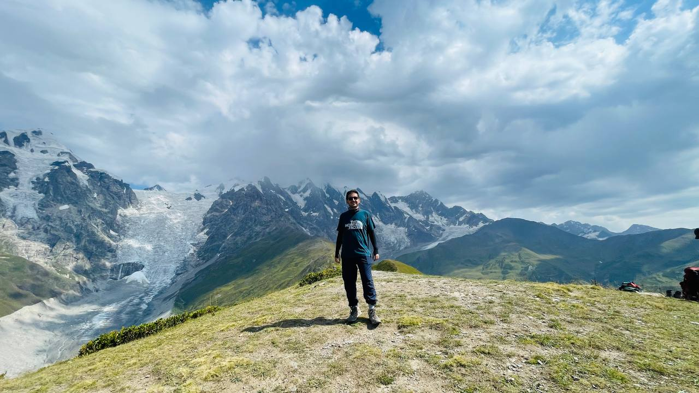

+++
date = '2025-11-28T01:45:50+03:30'
draft = false
title = 'Mestia to Ushguli Trek'
location = 'Georgia'
tags = ['hiking', 'georgia', 'svaneti']
featured_image = ''
+++

The trek from Mestia to Ushguli is one of the most spectacular hikes in the Caucasus mountains. This multi-day journey takes you through remote villages, stunning alpine landscapes, and the heart of Svaneti.

The trail offers breathtaking views of snow-capped peaks, ancient defensive towers, and traditional Svan villages that seem frozen in time.
